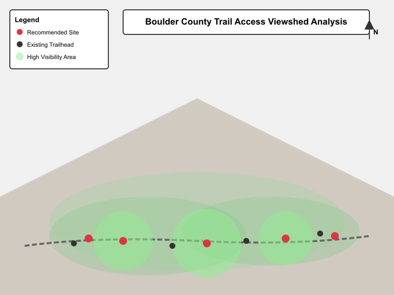

# Boulder County Trail Access Analysis

A viewshed analysis to identify optimal trailhead locations with mountain views for the Boulder County Parks Department.

## Problem/Question

Boulder County Parks wanted to identify potential new trailhead locations along Highway 119 that would provide visitors with scenic mountain views. The goal was to find locations with good visibility of the Continental Divide while remaining accessible from existing road infrastructure.

## Data

- **Digital Elevation Model (DEM)**: USGS 10m resolution DEM for Boulder County
- **Roads**: Boulder County road network shapefile
- **Existing Trailheads**: Current trailhead locations from Boulder County Open Data
- **Continental Divide**: Polyline feature from USGS National Map

**Sources**: USGS National Map, Boulder County GIS Open Data Portal

## Methods

I used viewshed analysis in ArcGIS Pro to identify areas with visibility of the Continental Divide peaks. The workflow included:

1. Preprocessed the DEM to fill sinks and ensure continuous terrain surface
2. Created observer points along Highway 119 at 100-meter intervals
3. Ran viewshed analysis from each observer point toward Continental Divide peaks
4. Calculated cumulative viewshed to identify locations with views of multiple peaks
5. Applied proximity analysis to exclude areas within 500m of existing trailheads
6. Ranked candidate locations based on viewshed score and road accessibility

## Results

The analysis identified five high-priority locations for new trailheads, with the top candidate located near the intersection of Highway 119 and Sugarloaf Road.

*Figure 1: Viewshed analysis results. Green areas indicate high visibility of Continental Divide peaks. Red points show recommended trailhead locations.*

## Analysis/Interpretation

The recommended location near Sugarloaf Road scored highest because it provides views of four major peaks (Mount Audubon, Navajo Peak, Apache Peak, and Shoshoni Peak) while having existing road access and adequate parking area. This location would minimize new infrastructure costs while maximizing scenic value for visitors.

Two of the five recommended sites are on private land and would require easement negotiations. The analysis also revealed that many existing trailheads have limited mountain views, suggesting opportunities for improved signage or viewing platforms at those locations.

## Skills Demonstrated

- Terrain analysis and DEM processing
- Viewshed analysis and visibility modeling
- Multi-criteria decision analysis
- Spatial overlay and proximity analysis
- Cartographic design and data visualization
- Written communication of geospatial analysis results

## Tools Used

- ArcGIS Pro (Spatial Analyst extension)
- Python (arcpy for batch viewshed processing)
- Adobe Illustrator (final map layout)

---

**Note to students**: This is an example project showing how to document your work. You can delete this file once you've added your own projects. The key elements to include are: problem statement, data sources, methods summary, results with visuals, interpretation, skills, and tools.
